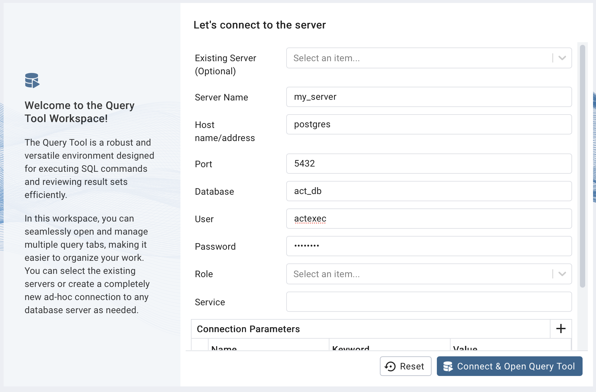
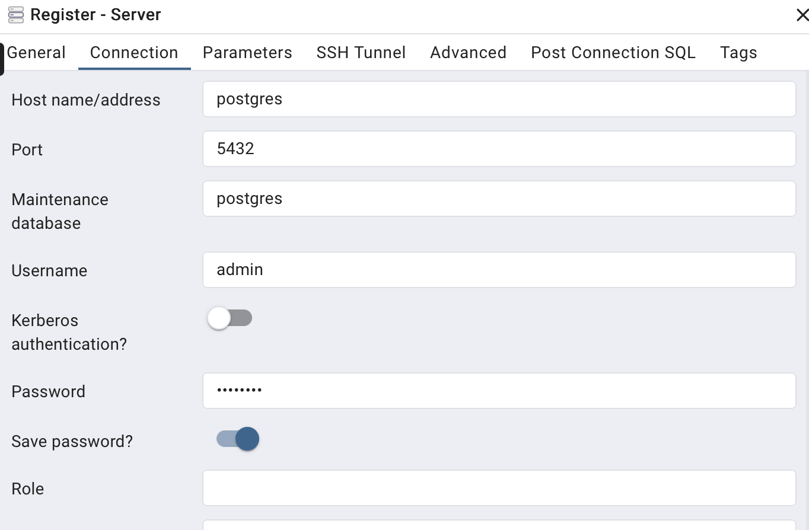

# act-website
Website for ACT Stats, Signup, Etc.

## Development
Clone the repo and enter the directory
```bash
git clone https://github.com/sig-pi-wm/act-website
cd act-website
```
Activate virtual environment and install dependencies
```bash
python -m venv .venv
source .venv/bin/activate
pip install -r requirements.txt
```
Run the database for development (you'll have to install docker and docker desktop as well)
```bash
docker compose up -d
```

Then navigate to [localhost:5050](https://localhost:5050) to access postgres, and you can sign in with the following credentials:


You may have to manually register the server if it's not showing up in the sidebar.
Right click "Servers, in the upper left, when you're in Object Explorer," and select Register Server.
Then type in the same info you logged in with:


(To shut down the database)
```bash
docker compose down
```
Run the flask app for development
```bash
python app.py
```

## Hosting
The domain registration is through cloudflare, at `allcuptour.com`. The flask webapp is hosted on [pythonanywhere.com](pythonanywhere.com), as is the MySQL database.

## Database

### Scheduled backups
I followed the steps in [this article](https://help.pythonanywhere.com/pages/MySQLBackupRestore/) to setup a daily backup script in pythonanywhere.
It can be found on the server at `~/db-backup.sh`.

### Restoring a backup
If the database is corrupted, restore the most recent backup, or a date's backup of your choice, by running this from the pythonanywhere bash console.
``` bash
cd ~
mysql -u actexec -h actexec.mysql.pythonanywhere-services.com 'actexec$act_db' < db-backups/DATE_db-backup.sql
```
